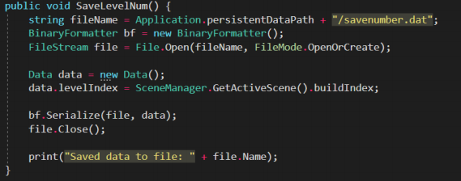

#CE318-Tank-Attack

## Software Used
1. Unity 2018.2
2. Aseprite
3. GitKraken

## Game Features
1. One playable character
2. Dynamic camera that follows the player
3. Collisions between game objects
4. Working physics
5. Multiple audio sources (Music, static sound effects, 3D sound effects)
6. Multiple light sources
7. Main menu
8. Settings menu (Volume slider, music toggle, difficulty selector)
9. End screen when player completes a level
10. Splash screen
11. Multiple levels connected together with fade transisitons (Tutorial, level1, level2)
12. Animations for aiming
13. Powerup system (Boost, fire rate increaser, health)
14. Difficulty levels (Enemies have more health, player has less health)
15. Game save/load system (Implemented by serialising an object and saving it to an external file
16. Multiple particle effects (Explosions, gun muzzle flash, etc)
17. Multiple materials (Floor, walls, tanks, beacons, particles, powerups)
18. AI (Developed using Unity's NavMesh feature, if I had more time to implement this I would have created a line of sight system)

## Images
### Explosion Particle System

### Level Maze

### Sample of code that handles powerup functionality

### Sample of code that handles saving of game to file

